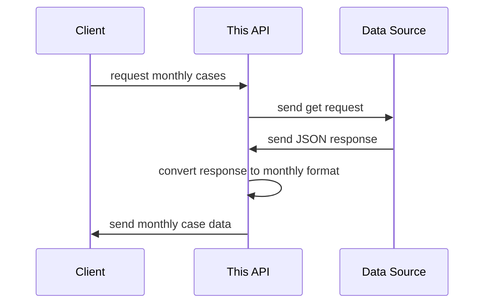

<p align="center" style="font-size: 5px">
  🚧 This repo currently undergoes a major refactoring effort, don't expect things to function normally 🚧 
</p>

---

<p align="center">
  <h1 align="center">Rust COVID-19 API</h1>

  <p align="center">
    A simple containerized COVID-19 API built using Rust & Actix Web
  </p>
</p>

<div align="center">
  
[![MIT License][license-shield]][license-url]
[![LinkedIn][linkedin-shield]][linkedin-url]
  
</div>

<!-- ABOUT THE PROJECT -->
## About The Project
In order to participate in Nodeflux's internship program as a software engineer, 
applicants are required to complete a technical assessment. We are tasked to build a 
containerized COVID-19 API using either C++, Rust, or Python.
This project is made to complete the said technical assessment. 

As said above, this project is a COVID-19 REST API where you can get daily, monthly, 
and yearly case data as well as specific date, month, or year. 
The data source is from https://data.covid19.go.id/public/api/update.json,
it is a COVID-19 API seemingly provided by the Indonesian government,
but the design is not quite good because it only provides 1 endpoint and 
the only respond it provides is in a daily format containing cases data 
since the begining of COVID-19 up until now.

This API is intended to provide more friendly interface and several response 
format options by masking the data source. 

The following is the diagram:


### Why Rust?
We were given 3 choice to build this API with: Python, Rust, and C++.
Initially the reason for choosing Rust was because I presume it's 
more impressive in the recruiter's eyes if I built it using Rust 
and so that I can treat it as my Rust learning playground as well.

But looking back, I think one more reason I can add to that is
Rust is fast in doing CPU-heavy operations, which is what this API
does on a regular basis (converting quite large amount
of data into another form). On the other hand, Python is not as fast 
in doing such operations and C++ is too hard for a beginner
like to get productive quickly and it seems like there are many 
pitfalls one need to watch out for as well,
thus in my opinion Rust is the ideal choice for this one.

<!-- GETTING STARTED -->
## Getting Started
### Using Docker
The docker image is available to pull from in the following url: [https://hub.docker.com/r/danilhendrasr/rust-covid-api](https://hub.docker.com/r/danilhendrasr/rust-covid-api).
#### Steps
```bash
# Pull the image from docker hub
docker pull danilhendrasr/rust-covid-api

# Run the container, will be accessible through localhost:8081
docker run -d --name rust-covid-api -p 8081:8081 danilhendrasr/rust-covid-api
```

### Build from source
#### Prerequisites
- Rust 1.57 (used to write this program)
- pkg-config (for linux system)
- libssl-dev (for linux system)

#### Steps
```bash
# clone the repo
git clone https://github.com/danilhendrasr/nodeflux-technical-assessment rust-covid-api

# change the current directory
cd rust-covid-api

# build program and dependencies
cargo build --release

# run the program, the app will be accessible through localhost:8081
cargo run --release
```

## API Contract
The API contract mostly stays the same as written in the technical assessment document, with only several minor additions such as:
- The API will respond with `400 (Bad request)` response with `Invalid query parameter(s)` text body if invalid query parameter(s) are supplied to the following routes:
  - `/yearly`
  - `/monthly`
  - `/monthly/<year>`
  - `/daily`
  - `/daily/<year>`
  - `/daily/<year>/<month>`
- The API will respond with `500 (Internal server error)` response with a short description in the body if it fails to fetch or process the data.

<!-- LICENSE -->
## License

Distributed under the MIT License. See [LICENSE](https://github.com/danilhendrasr/nodeflux-technical-assessment/blob/main/LICENSE) for more information.


<!-- ACKNOWLEDGEMENTS -->
## Acknowledgements
* [Nodeflux](https://nodeflux.io)
* [Rust](https://github.com/rust-lang/rust)
* [Actix Web](https://github.com/rust-lang/rust)


<!-- MARKDOWN LINKS & IMAGES -->
<!-- https://www.markdownguide.org/basic-syntax/#reference-style-links -->
[contributors-shield]: https://img.shields.io/github/contributors/othneildrew/Best-README-Template.svg?style=for-the-badge
[contributors-url]: https://github.com/othneildrew/Best-README-Template/graphs/contributors
[forks-shield]: https://img.shields.io/github/forks/othneildrew/Best-README-Template.svg?style=for-the-badge
[forks-url]: https://github.com/othneildrew/Best-README-Template/network/members
[stars-shield]: https://img.shields.io/github/stars/danilhendrasr/yali4j.svg?style=for-the-badge
[stars-url]: https://github.com/danilhendrasr/yali4j/stargazers
[issues-shield]: https://img.shields.io/github/issues/danilhendrasr/yali4j.svg?style=for-the-badge
[issues-url]: https://github.com/danilhendrasr/yali4j/issues
[license-shield]: https://img.shields.io/github/license/danilhendrasr/yali4j.svg?style=for-the-badge
[license-url]: https://github.com/danilhendrasr/yali4j/blob/main/LICENSE
[linkedin-shield]: https://img.shields.io/badge/-LinkedIn-black.svg?style=for-the-badge&logo=linkedin&colorB=555
[linkedin-url]: https://linkedin.com/in/danilhendrasr
[product-screenshot]: images/screenshot.png
