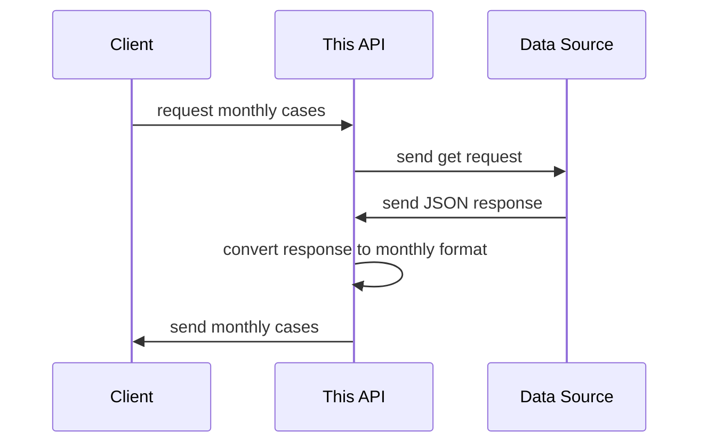

<div id="top"></div>

---

<p align="center">
  <h1 align="center">Rust COVID-19 API</h1>

  <p align="center">
    A simple containerized COVID-19 API built using Rust & Actix Web
  </p>
</p>

<div align="center">
  
[![MIT License][license-shield]][license-url]
[![LinkedIn][linkedin-shield]][linkedin-url]
  
</div>

<!-- ABOUT THE PROJECT -->
## About The Project
In order to participate in Nodeflux's internship program as a software engineer, 
applicants were required to complete a technical assessment. We were tasked to build a 
containerized COVID-19 API using either C++, Rust, or Python.
This project is made to complete the said technical assessment. 

This API is only a mask API, the data source is https://data.covid19.go.id/public/api/update.json,
it is a COVID-19 API seemingly provided by the Indonesian government,
but the design is not quite good because it only provides 1 endpoint and 
the only respond it provides is in a daily format containing all daily cases 
since the begining of COVID-19.

This API provides a more friendly interface, users can get the data in daily, monthly, 
and yearly format as well as search for specific date, month, and/or year.

The following is the diagram:


### Why Rust? 🤔
Initially the reason for choosing Rust was because I presume it's 
more impressive in the recruiter's eyes if I built it using Rust 
and so that I can treat it as my Rust learning playground as well.

But looking back, I think one more reason I can add to that is
Rust is fast in doing CPU-heavy operations, which is what this API
does on a regular basis (converting quite large amount
of data into another form). On the other hand, Python is not as fast 
in doing such operations and C++ is too hard for a beginner
like to get productive quickly,
thus in my opinion Rust is the ideal choice for this one.

### No caching? 😕
Not at the moment.

### Tests?
There are some tests in place already but it's incomplete, 
I'm planning to complete it soon, see roadmap. 

### API Contract 📗
See [the wiki](https://github.com/danilhendrasr/rust-covid-api/wiki/API-Contract).

<p align="right">(<a href="#top">back to top</a>)</p>

<!-- GETTING STARTED -->
## Getting Started
### Using Docker
The docker image is available to pull from in the following url: [https://hub.docker.com/r/danilhendrasr/rust-covid-api](https://hub.docker.com/r/danilhendrasr/rust-covid-api).
#### Steps
```bash
# Pull the image from docker hub
docker pull danilhendrasr/rust-covid-api

# Run the container, will be accessible through localhost:8081
docker run -d --name rust-covid-api -p 8081:8081 danilhendrasr/rust-covid-api
```

<p align="right">(<a href="#top">back to top</a>)</p>

### Build from source
#### Prerequisites
- Rust 1.57 (used to write this program)
- pkg-config (for linux system)
- libssl-dev (for linux system)

#### Steps
```bash
# clone the repo
git clone https://github.com/danilhendrasr/nodeflux-technical-assessment rust-covid-api

# change the current directory
cd rust-covid-api

# build program and dependencies
cargo build --release

# run the program, the app will be accessible through localhost:8081
cargo run --release
```

<p align="right">(<a href="#top">back to top</a>)</p>

<!-- ROADMAP -->
## Roadmap

- [x] Complete the refactoring
- [x] Create automated deployment pipeline
- [ ] Add more tests
- [ ] Add caching mechanism

See the [open issues][issues-url] for a full list of proposed features (and known issues).

<p align="right">(<a href="#top">back to top</a>)</p>

<!-- LICENSE -->
## License

Distributed under the MIT License. See [LICENSE][license-url] for more information.


<!-- ACKNOWLEDGEMENTS -->
## Acknowledgements
* [Nodeflux](https://nodeflux.io)
* [Rust](https://github.com/rust-lang/rust)
* [Actix Web](https://github.com/rust-lang/rust)

<p align="right">(<a href="#top">back to top</a>)</p>

<!-- MARKDOWN LINKS & IMAGES -->
<!-- https://www.markdownguide.org/basic-syntax/#reference-style-links -->
[repo-url]: (https://github.com/danilhendrasr/rust-covid-api)
[stars-shield]: https://img.shields.io/github/stars/danilhendrasr/rust-covid-api.svg?style=for-the-badge
[stars-url]: https://github.com/danilhendrasr/rust-covid-api/stargazers
[issues-shield]: https://img.shields.io/github/issues/danilhendrasr/rust-covid-api.svg?style=for-the-badge
[issues-url]: https://github.com/danilhendrasr/rust-covid-api/issues
[license-shield]: https://img.shields.io/github/license/danilhendrasr/rust-covid-api.svg?style=for-the-badge
[license-url]: https://github.com/danilhendrasr/rust-covid-api/blob/main/LICENSE

[contributors-shield]: https://img.shields.io/github/contributors/othneildrew/Best-README-Template.svg?style=for-the-badge
[contributors-url]: https://github.com/othneildrew/Best-README-Template/graphs/contributors
[forks-shield]: https://img.shields.io/github/forks/othneildrew/Best-README-Template.svg?style=for-the-badge
[forks-url]: https://github.com/othneildrew/Best-README-Template/network/members
[stars-shield]: https://img.shields.io/github/stars/danilhendrasr/yali4j.svg?style=for-the-badge
[stars-url]: https://github.com/danilhendrasr/yali4j/stargazers
[issues-shield]: https://img.shields.io/github/issues/danilhendrasr/yali4j.svg?style=for-the-badge
[issues-url]: https://github.com/danilhendrasr/yali4j/issues
[license-shield]: https://img.shields.io/github/license/danilhendrasr/yali4j.svg?style=for-the-badge
[license-url]: https://github.com/danilhendrasr/yali4j/blob/main/LICENSE
[linkedin-shield]: https://img.shields.io/badge/-LinkedIn-black.svg?style=for-the-badge&logo=linkedin&colorB=555
[linkedin-url]: https://linkedin.com/in/danilhendrasr
[product-screenshot]: images/screenshot.png
